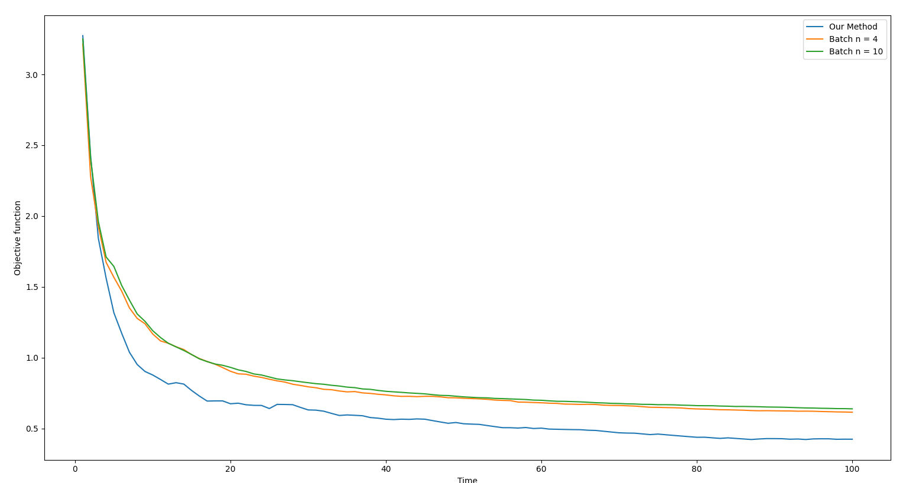

# Online-Dictionary-Learning-for-Sparse-Coding

Online Dictionary Learning for Sparse Coding

## Results

### 1. Plotting the Objective Function VS Time _(using the online method, batch size of 4, batch size of 10)_

- We used 100 iterations on this example.

### 2. Plotting the Difference Matrix _(between the original dataset X, and reconstructed dataset x_hat)_

- This heat map illustrates the absolute difference between the original dataset values, and the entries of the reconstructed matrix.
- The darker the color, the more closer the reconstructed entries to the original ones.
- We just used 5 iterations on this example.

### K = 20

1. First Iteration

.png>)

2. Final (Fifth) Iteration

.png>)

### K = 40

1. First Iteration

.png>)

2. Final (Fifth) Iteration

.png>)

### K = 60

1. First Iteration

.png>)

2. Final (Fifth) Iteration

.png>)

### K = 80

1. First Iteration

.png>)

2. Final (Fifth) Iteration

.png>)

### K = 100

1. First Iteration

.png>)

2. Final (Fifth) Iteration

.png>)

> **Conclusion**: The larger the value of K _(hence the larger the dictionary)_, the larger the faster the convergence of the reconstructed signal to the original.
